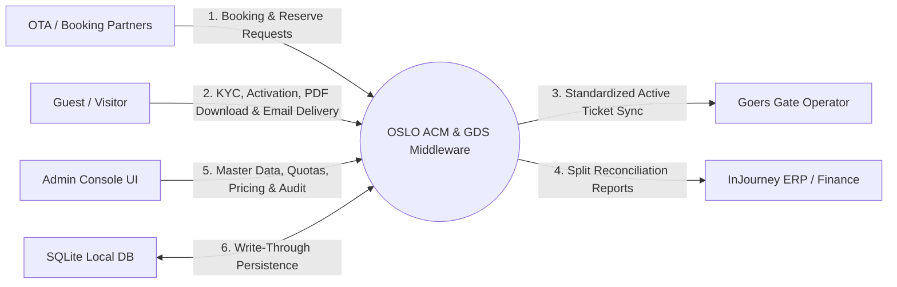
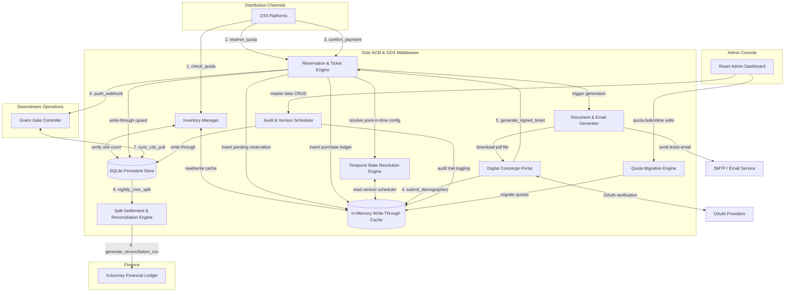

# System Architecture & ERP Blueprint: Oslo Attraction Channel Manager (ACM) & GDS Middleware

This document serves as the formal **System & ERP Blueprint** for the **Oslo Attraction Channel Manager (ACM) & GDS Middleware** platform. It defines the software architecture, data structures, transactional state machines, persistence layer, and API endpoints required to integrate third-party OTAs with downstream gate operations (operated by Goers) at Taman Wisata Candi (TWC) and other InJourney destinations.

---

## 1. Document Control & System Context

* **Document Version:** 2.0.0 (SQLite Persistence, Temporal Versioning & Full Admin Console)
* **Author:** Antigravity (Advanced Agentic Coding Team, Google DeepMind)
* **Status:** Working Implementation — Live Simulator Running
* **Target Audience:** InJourney Enterprise Architects, Financial Directors, Security Officers, Goers Engineering Team
* **Operational Stack:** TypeScript · Express.js · Vite · React · SQLite3 · Node.js v22

---

## 2. System Data Flow Diagrams (DFD)

### Level 0: System Context Diagram
Shows high-level interfaces between Oslo, external distribution channels, guest portals, and downstream gate systems.



### Level 1: Subsystem Data Flow Diagram
Tracks the detailed flow of data and storage updates between individual modules inside Oslo ACM.



---

## 3. Persistence Architecture

### 3.1 Write-Through Cache with SQLite

The middleware operates a **dual-layer write-through cache** architecture:

| Layer | Technology | Purpose |
|-------|-----------|---------|
| **L1 — In-Memory Arrays** | Node.js runtime objects | Sub-millisecond read latency for all API queries. Hot-path for transactional endpoints. |
| **L2 — SQLite Relational Store** | `sqlite3` on-disk database (`gds.db`) | Durable persistence surviving server restarts, file edits, and HMR reloads. |

**Write Path:** Every mutating API endpoint updates the in-memory array synchronously, then fires an asynchronous `dbManager` upsert call (`INSERT OR REPLACE`) to the SQLite store.

**Read Path (Bootstrap):** On server start, `loadDatabaseFromSqlite()` checks whether the SQLite database contains records. If populated, all tables are loaded and deserialized into memory. If empty, the seed script `seedInitialDatabase()` pre-populates default baselines and writes them into SQLite.

### 3.2 Database File Specification

| Property | Value |
|----------|-------|
| Filename | `gds.db` |
| Location | Project workspace root (`oslo-acm-gds/`) |
| Engine | SQLite 3 via `node-sqlite3` (v5.1.7+) |
| Tables | 14 relational tables |
| JSON Columns | `open_days`, `time_slots`, `ticket_types`, `items`, `stop_sells`, `users`, `payload`, `unearned_splits_snapshot`, `realized_splits`, `original_state`, `modified_state` |

---

## 4. Database Schema Design (SQLite DDL)

### 4.1 Core Operational Tables

```sql
-- 1. Destination Locations (Attraction Sites)
CREATE TABLE IF NOT EXISTS destinations (
    id TEXT PRIMARY KEY,
    name TEXT NOT NULL,
    code TEXT NOT NULL,                         -- e.g., 'BOROBUDUR_TEMPLE'
    created_at TEXT,
    allocation_control TEXT DEFAULT 'time',     -- 'time' | 'daily'
    base_price_idr INTEGER DEFAULT 100000,
    open_days TEXT,                             -- JSON array: ["Monday","Tuesday",...]
    time_slots TEXT,                            -- JSON array: ["08:00","09:00",...]
    timezone TEXT DEFAULT 'WIB',               -- 'WIB' | 'WITA' | 'WIT'
    ticket_types TEXT,                          -- JSON array of TicketType objects
    effective_from TEXT,
    changed_by TEXT,
    operator_role TEXT,
    ip_address TEXT,
    client_channel TEXT
);

-- 2. Quota Settings (Inventory Slots)
CREATE TABLE IF NOT EXISTS destination_quotas (
    id TEXT PRIMARY KEY,
    destination_id TEXT REFERENCES destinations(id),
    date TEXT NOT NULL,                          -- YYYY-MM-DD
    time_slot TEXT NOT NULL,                     -- HH:MM or 'All Day'
    model TEXT DEFAULT 'derived',               -- 'derived' | 'segmented'
    total_capacity INTEGER NOT NULL,
    walk_in_buffer INTEGER NOT NULL,
    allocated_ota_capacity INTEGER NOT NULL,
    remaining_capacity INTEGER NOT NULL,
    created_at TEXT,
    stop_sells TEXT                              -- JSON array of OTA codes: ["klook","tiket_com"]
);

-- 3. Segmented Quota Details (OTA Block Limits)
CREATE TABLE IF NOT EXISTS segmented_quota_details (
    id TEXT PRIMARY KEY,
    quota_id TEXT REFERENCES destination_quotas(id),
    segment_name TEXT NOT NULL,                  -- e.g., 'WNI Adult', 'WNA Child'
    capacity INTEGER NOT NULL,
    remaining INTEGER NOT NULL
);

-- 4. Reservations (Inventory Booking Holds)
CREATE TABLE IF NOT EXISTS reservations (
    id TEXT PRIMARY KEY,
    quota_id TEXT REFERENCES destination_quotas(id),
    ota_code TEXT NOT NULL,
    guest_count INTEGER NOT NULL,
    status TEXT DEFAULT 'reserved',              -- 'reserved' | 'confirmed' | 'expired'
    expires_at TEXT NOT NULL,                    -- 10-minute reservation hold TTL
    created_at TEXT
);

-- 5. Tickets (Issued Digital Vouchers)
CREATE TABLE IF NOT EXISTS tickets (
    id TEXT PRIMARY KEY,
    reservation_id TEXT REFERENCES reservations(id),
    ticket_code TEXT UNIQUE NOT NULL,            -- e.g., 'OSL-BORO-482915'
    visitor_profile_id TEXT,
    status TEXT DEFAULT 'inactive',              -- 'inactive' | 'active' | 'redeemed' | 'expired' | 'refunded'
    unit_price INTEGER NOT NULL,
    created_at TEXT,
    activated_at TEXT,
    redeemed_at TEXT,
    ticket_type_name TEXT,                       -- e.g., 'Adult (Domestic)', 'Child (Foreigner)'
    ota_code TEXT,
    guest_name TEXT
);

-- 6. Split Configurations (Accrual Split Rules)
CREATE TABLE IF NOT EXISTS split_configurations (
    id TEXT PRIMARY KEY,
    destination_id TEXT REFERENCES destinations(id),
    stakeholder_name TEXT NOT NULL,
    split_type TEXT DEFAULT 'percentage',        -- 'percentage' | 'fixed'
    amount REAL NOT NULL,                        -- Decimal-precise (e.g., 60.00, 88.2)
    created_at TEXT,
    effective_from TEXT,
    changed_by TEXT,
    operator_role TEXT,
    ip_address TEXT,
    client_channel TEXT
);

-- 7. Purchase Ledger (Unearned Revenue Liability)
CREATE TABLE IF NOT EXISTS purchase_ledger (
    id TEXT PRIMARY KEY,
    ticket_id TEXT REFERENCES tickets(id),
    destination_id TEXT REFERENCES destinations(id),
    total_amount REAL NOT NULL,
    unearned_balance REAL NOT NULL,
    unearned_splits_snapshot TEXT,                -- JSON array of stakeholder split amounts
    purchased_at TEXT,
    is_settled INTEGER DEFAULT 0                 -- Boolean: 0 = unsettled, 1 = settled
);

-- 8. Revenue Recognition Ledger (Realized Revenue Credit)
CREATE TABLE IF NOT EXISTS revenue_recognition_ledger (
    id TEXT PRIMARY KEY,
    purchase_ledger_id TEXT REFERENCES purchase_ledger(id),
    ticket_id TEXT REFERENCES tickets(id),
    destination_id TEXT REFERENCES destinations(id),
    recognized_amount REAL NOT NULL,
    trigger_type TEXT NOT NULL,                   -- 'scan' | 'expiration' | 'no_show_closeout'
    realized_splits TEXT,                         -- JSON array of realized stakeholder allocations
    recognized_at TEXT
);
```

### 4.2 Multi-Attraction & Package Tables

```sql
-- 9. Joint Ticket Bundles (Multi-Site Combo Packages)
CREATE TABLE IF NOT EXISTS joint_ticket_bundles (
    id TEXT PRIMARY KEY,
    name TEXT NOT NULL,
    code TEXT NOT NULL,
    description TEXT,
    items TEXT,                                   -- JSON array of JointTicketItem objects
    price_idr INTEGER NOT NULL,
    active INTEGER DEFAULT 1,                    -- Boolean
    created_at TEXT,
    effective_from TEXT,
    changed_by TEXT
);
```

### 4.3 Audit, Versioning & Governance Tables

```sql
-- 10. Audit Logs (Append-Only Master Data Change Traces)
CREATE TABLE IF NOT EXISTS audit_logs (
    id TEXT PRIMARY KEY,
    directory_section TEXT NOT NULL,              -- 'Attraction Site' | 'Master Ticket' | 'Split Ratio' | 'Joint Ticket Bundle'
    record_id TEXT NOT NULL,
    action_type TEXT NOT NULL,                   -- 'CREATE' | 'UPDATE' | 'DELETE' | 'RESERVE_SCHEDULE'
    changed_by TEXT NOT NULL,
    changed_at TEXT NOT NULL,
    original_state TEXT,                          -- JSON snapshot of previous configuration
    modified_state TEXT,                          -- JSON snapshot of new configuration
    operator_role TEXT,
    ip_address TEXT,
    client_channel TEXT
);

-- 11. Master Data Version Scheduler (Point-in-Time Configuration Versions)
CREATE TABLE IF NOT EXISTS master_data_version_scheduler (
    id TEXT PRIMARY KEY,
    entity_type TEXT NOT NULL,                   -- 'destination_price' | 'split_config' | 'ticket_type'
    entity_id TEXT NOT NULL,
    payload TEXT,                                 -- JSON configuration payload
    effective_from TEXT NOT NULL,                 -- YYYY-MM-DD cutoff date
    status TEXT DEFAULT 'scheduled',             -- 'scheduled' | 'active' | 'superseded'
    created_by TEXT,
    created_at TEXT
);
```

### 4.4 Channel & Organization Master Data Tables

```sql
-- 12. OTA Connectors (Third-Party Channel Configurations)
CREATE TABLE IF NOT EXISTS ota_connectors (
    id TEXT PRIMARY KEY,
    name TEXT NOT NULL,
    code TEXT NOT NULL,                           -- e.g., 'traveloka', 'klook', 'tiket_com', 'own_web'
    api_key TEXT,
    status TEXT DEFAULT 'active',                -- 'active' | 'inactive'
    quota_percentage REAL                        -- Channel allocation percentage
);

-- 13. Organization Entities (Tenant Business Unit Hierarchy)
CREATE TABLE IF NOT EXISTS org_entities (
    id TEXT PRIMARY KEY,
    name TEXT NOT NULL,
    type TEXT NOT NULL,                           -- 'parent' | 'subsidiary' | 'branch'
    parent_id TEXT,
    users TEXT                                    -- JSON array of {email, role, name}
);

-- 14. Dynamic Pricing Rules (Seasonal & Temporal Modifiers)
CREATE TABLE IF NOT EXISTS pricing_rules (
    id TEXT PRIMARY KEY,
    destination_id TEXT REFERENCES destinations(id),
    name TEXT NOT NULL,
    type TEXT NOT NULL,                           -- 'peak_hour' | 'season' | 'weekend'
    modifier_percentage REAL NOT NULL,           -- e.g., +15.0 for weekend, +25.0 for peak hour
    applies_to TEXT NOT NULL,                    -- 'Saturday/Sunday', '08:00,09:00', '2026-06-20/2026-06-30'
    is_active INTEGER DEFAULT 1
);
```

---

## 5. TypeScript Interface Model Layer

All 18 domain interfaces are defined in both the backend ([server.ts](file:///c:/Users/aryor.000/Documents/Voyage/Oslo/oslo-acm-gds/server.ts)) and frontend ([types.ts](file:///c:/Users/aryor.000/Documents/Voyage/Oslo/oslo-acm-gds/src/types.ts)) with full parity:

| Interface | Purpose | Key Fields |
|-----------|---------|------------|
| `Destination` | Attraction site master record | `allocation_control`, `base_price_idr`, `ticket_types[]`, `time_slots[]`, `open_days[]`, `timezone` |
| `TicketType` | Tier pricing category | `name`, `active`, `percentage` (decimal-capable, max 50 types) |
| `DestinationQuota` | Date/timeslot inventory cell | `total_capacity`, `walk_in_buffer`, `remaining_capacity`, `stop_sells[]` |
| `SegmentedQuotaDetail` | OTA segment block limit | `segment_name`, `capacity`, `remaining` |
| `Reservation` | Booking hold record | `ota_code`, `guest_count`, `status`, `expires_at` |
| `Ticket` | Issued digital voucher | `ticket_code`, `status`, `unit_price`, `ticket_type_name`, `visitor_profile_id` |
| `VisitorProfile` | KYC demographic data | `nationality`, `provinsi`, `kabupaten_kota`, `age_bracket`, `gender`, `oauth_email` |
| `SplitConfiguration` | Accrual split rule | `stakeholder_name`, `split_type`, `amount`, `effective_from` |
| `PurchaseLedger` | Unearned revenue liability | `total_amount`, `unearned_balance`, `unearned_splits_snapshot`, `is_settled` |
| `RevenueRecognitionLedger` | Realized revenue credit | `recognized_amount`, `trigger_type`, `realized_splits` |
| `JointTicketBundle` | Multi-site combo package | `items[]`, `price_idr`, `active` |
| `OTAConnector` | Channel partner config | `code`, `api_key`, `status`, `quota_percentage` |
| `OrgEntity` | Tenant hierarchy node | `type` (parent/subsidiary/branch), `users[]` |
| `DynamicPricingRule` | Seasonal pricing modifier | `type`, `modifier_percentage`, `applies_to` |
| `AuditLog` | Change trace record | `directory_section`, `action_type`, `original_state`, `modified_state`, `operator_role` |
| `AuditTrail` | Legacy change trace | `change_type`, `action`, `previous_state`, `new_state` |
| `MasterDataVersionScheduler` | Scheduled configuration version | `entity_type`, `payload`, `effective_from`, `status` |
| `DashboardMetrics` | Aggregated KPI metrics | `totalReservations`, `grossUnearned`, `grossRealized`, `stakeholderSharesAccumulated` |

---

## 6. Core Accounting & Operational Modules

### A. Inventory Management Module (Flexible Quotas)

The system supports two quota models per destination, configurable via the Admin Panel with live migration:

| Model | Behavior |
|-------|----------|
| **Derived Quota Pool** (Default) | All ticket tiers draw from a single physical quota pool. Capacity is shared across all OTA channels. |
| **Segmented Quota Pool** | Quotas are strictly isolated per visitor segment (e.g., WNI Adult, WNA Child). Each segment has independent capacity limits. |

**Allocation Control Modes:**

| Mode | Quota Granularity | Time Slot Column |
|------|-------------------|-----------------|
| `time` | Individual hourly time slots (e.g., 08:00, 09:00, ...) | `HH:MM` |
| `daily` | Single aggregated daily block | `All Day` |

**Quota Migration Engine:** When `allocation_control` is toggled on a destination, the `migrateQuotasForDestination()` function performs a live schema migration:

- **Time → Daily:** Aggregates all hourly slot capacities into a single `All Day` record, summing total capacity, walk-in buffers, and merging stop-sell channel lists.
- **Daily → Time:** Splits the `All Day` record back into individual time slot records, distributing capacity evenly across the destination's configured time slots.

### B. Channel Stop-Sell Controls

Each quota slot carries an optional `stop_sells` array of OTA connector codes. When a channel code is present:
- The `/api/v1/inventory/reserve` and `/api/v1/ota/purchase` endpoints reject bookings from that channel with HTTP `400`.
- The Admin Calendar UI displays per-connector status badges: **ACTIVE** (green), **PARTIAL** (yellow), **STOPPED** (red).

### C. Cryptographic Token Engine

Generates entry credentials using JSON Web Tokens (JWT) signed with Oslo's private key (RS256). Turnstiles verify tickets offline using Oslo's public key. Tokens contain the complete ticket object encoded as a Base64 payload.

### D. Accrual Splits & Revenue Recognition Engine

Manages the double-entry accrual accounting split ledgers with point-in-time configuration resolution:

| Ledger | Trigger | Accounting Effect |
|--------|---------|-------------------|
| **Purchase Ledger** (Unearned Revenue) | Ticket confirmation (`POST /api/v1/inventory/confirm`) | Debit Cash, Credit Unearned Revenue (Liability) |
| **Revenue Recognition Ledger** (Realized Revenue) | Gate scan (`POST /api/v1/tickets/redeem`) or validity expiration | Debit Unearned Revenue, Credit Realized Revenue |

**Split Snapshot Architecture:** At confirmation time, the active split configuration ratios are resolved and frozen into a `unearned_splits_snapshot` JSON column. This ensures that subsequent changes to split percentages do not retroactively affect already-booked transactions.

### E. Temporal State Resolution Engine

Implements **point-in-time version scheduling** for master data configurations:

- **`resolveDestination(id, dateStr)`** — Resolves a destination's effective configuration (price, ticket types, allocation control) for a given transaction date by querying the `master_data_version_scheduler` for the most recent matching version.
- **`resolveSplitConfigs(id, dateStr)`** — Resolves effective split ratios for a given date, falling back to baseline configurations if no scheduled version matches.

**Scheduling Workflow:**
1. Admin sets a **future effective date** when modifying a configuration.
2. The system writes a `MasterDataVersionScheduler` record with `status: 'scheduled'`.
3. Baseline values remain unchanged — the scheduled version lies dormant.
4. When a transaction occurs on or after the effective date, `resolveDestination()` dynamically applies the scheduled payload.
5. If the admin later applies an immediate update, prior active versions are marked `superseded`.

### F. Document & Email Delivery Module

- **HTML-to-PDF Renderer:** Generates formatted entry ticket documents accessible at `/api/v1/docs/pdf/:ticketCode`. Includes destination name, date/time slot, ticket reference code, price, guest KYC summary, and JWT QR payload.
- **Email Sender Worker:** Connects to transactional SMTP servers (e.g., AWS SES, SendGrid) to send emails with PDF attachments. Uses RabbitMQ/Redis queueing to handle retries.

### G. Dynamic Pricing Rules Engine

Supports three modifier types applied to base prices at transaction time:

| Type | `applies_to` Format | Example |
|------|---------------------|---------|
| `weekend` | Day names: `Saturday/Sunday` | +15% weekend surcharge |
| `peak_hour` | Time slots: `08:00,09:00` | +25% sunrise prime slots |
| `season` | Date range: `2026-06-20/2026-06-30` | +10% summer peak demand |

### H. Joint Ticket Bundles (Multi-Site Combo Packages)

Enables bundled ticketing across multiple attraction sites at discounted composite prices:

| Pre-seeded Bundle | Sites | Bundle Price | Savings |
|-------------------|-------|-------------|---------|
| Candi Heritage Joint Pass | Borobudur + Prambanan | IDR 195,000 | IDR 30,000 |
| TWC Explorer Combo Pass | Borobudur + Prambanan + Ratu Boko | IDR 220,000 | IDR 55,000 |

### I. Configurable Ticket Types

Each destination supports up to **50 custom ticket types**, each with:
- A descriptive name (e.g., "Adult (Domestic)", "VIP Priority Pass")
- An active/inactive toggle
- A decimal-precise percentage multiplier relative to the base price (e.g., 88.2%)

**9 default ticket types** are pre-seeded:

| Type | Percentage | Default Status |
|------|-----------|---------------|
| Adult (Domestic) | 100% | Active |
| Child (Domestic) | 50% | Active |
| Adult (Foreigner) | 250% | Active |
| Child (Foreigner) | 125% | Active |
| Student / Academic | 40% | Active |
| VIP Priority Pass | 200% | Active |
| Group Discount (10+) | 85% | Inactive |
| Early Bird Promo | 75% | Inactive |
| Elderly / Kitas | 60% | Inactive |

---

## 7. PWA Digital Concierge Integration Sequence

Below is the execution sequence for visitor check-in, identity registration (KYC), ticket activation, PDF rendering, and Web2 email delivery.

```mermaid
sequenceDiagram
    autonumber
    actor Guest as Visitor
    participant PWA as Oslo Digital Concierge PWA
    participant OAuth as Identity Provider (Gmail/Facebook)
    participant Oslo as Oslo ACM Middleware
    participant Docs as PDF & Email Generator
    participant Goers as Goers Downstream API
    database DB as SQLite DB (gds.db)

    Guest->>PWA: Click Activation Link (from OTA voucher)
    PWA->>OAuth: Redirect to Login
    OAuth-->>PWA: Return Auth Token & Email Address
    PWA->>Guest: Request Demographic Data (Nationality, NIK/Passport, Region, Age, Gender)
    Guest-->>PWA: Submit Demographics
    PWA->>Oslo: Call /api/v1/tickets/activate (reservation_id, profile data, send_email: true)
    
    rect rgb(220, 240, 255)
        Note over Oslo, DB: Write-Through Transaction
        Oslo->>DB: Insert demographic data into visitor_profiles
        Oslo->>Oslo: Generate JWT Token signed with Private Key (RS256)
        Oslo->>DB: Update tickets status to 'active' & attach profile_id
    end
    
    Oslo->>Docs: Dispatch Generation Task (JWT Payload, OAuth Email)
    
    par Async Actions
        Docs->>Docs: Render Ticket PDF (HTML to PDF)
        Docs->>SMTP: Send Email with PDF Attachment to OAuth Email Address
        Oslo->>Goers: Push Webhook Event (ticket_id, status: 'active')
    end
    
    Oslo-->>PWA: Return Standardized JWT QR Payload & PDF Download URL
    PWA-->>Guest: Render Active Entry QR Code & Display "Download PDF" / "Emailed to you" status
```

---

## 8. App User Journeys

### Journey 1: Digital OTA Booking & Active QR Ticket Issuance
1. **Purchase:** A guest buys a ticket for Borobudur Candi on Traveloka.
2. **Voucher Generation:** Traveloka calls Oslo's `POST /api/v1/inventory/reserve` to hold inventory (10-minute hold), then `POST /api/v1/inventory/confirm` to secure it. Traveloka issues a generic **Purchase Voucher** to the guest.
3. **Channel Validation:** Oslo checks whether the requesting OTA channel is stop-sold for the requested date/time slot. If so, the reservation is rejected.
4. **Split Snapshot:** At confirmation, the system resolves the effective split configuration for the transaction date (via `resolveSplitConfigs`) and freezes the ratios into the `purchase_ledger`.
5. **Activation Trigger:** The guest clicks "Activate Ticket" in the Traveloka app, which redirects them to the **Oslo Digital Concierge** portal.
6. **OAuth Login:** The guest authenticates using a Web2 provider (Gmail or Facebook), giving Oslo access to their authenticated email address.
7. **Demographic Input:** The guest completes the check-in form for all participants.
8. **QR Issuance:** Oslo registers the visitor profile, locks credentials, and generates a cryptographically signed standard QR code (JWT format) pushed to the Goers gate database.
9. **Delivery Options:** 
   * **PDF Download:** The guest can click "Download PDF Ticket" to generate and download a print-ready A4 ticket containing the QR codes and entry instructions.
   * **Email Delivery:** The system automatically dispatches an email containing the PDF ticket as an attachment directly to the Gmail/Facebook address retrieved during OAuth login.

### Journey 2: Direct OTA Purchase (Single-Step Checkout)
1. **Purchase:** OTA calls `POST /api/v1/ota/purchase` with destination code, date, time slot, guest count, OTA code, and optional `purchase_date`.
2. **Temporal Resolution:** The system resolves pricing and split configurations effective on the `purchase_date` (defaults to today).
3. **Inventory Hold + Confirm:** The endpoint atomically reserves inventory, creates a confirmed reservation, generates inactive tickets, and writes purchase ledger entries — all in a single API call.
4. **Response:** Returns ticket codes, resolved prices (with ticket type multipliers applied), and the effective split ratios used.

### Journey 3: On-Site Offline Ticketing Box (Walk-Up Sales)
1. **Sale:** A visitor purchases a ticket at the physical booth using cash or card.
2. **Syncing Check:** 
   * **Online Mode:** The booth terminal calls Oslo's endpoint to deduct quota in real-time.
   * **Offline Mode:** The local booth terminal falls back to its pre-allocated "Walk-in Buffer". It prints a paper ticket containing a pre-cached cryptographic token (JWT) signed by Oslo.
3. **Data Reconciliation:** When the booth regains internet connection, it pushes all offline transaction logs to `POST /api/v1/sync/reconcile` to adjust Oslo's GDS inventory and run split reports.

### Journey 4: Gate Scan & Revenue Recognition
1. **Scan:** A visitor presents their QR code at the Goers turnstile.
2. **Validation:** Goers calls `POST /api/v1/tickets/redeem` with the ticket code.
3. **State Transition:** The ticket status transitions from `active` → `redeemed`.
4. **Accounting Trigger:** The corresponding `purchase_ledger` entry is marked `is_settled = true` and `unearned_balance = 0`. A new `revenue_recognition_ledger` record is created with `trigger_type: 'scan'`, transferring the frozen split snapshot to `realized_splits`.

---

## 9. Admin Console Functional Modules

The React-based Admin Console provides the following operational modules:

```mermaid
flowchart TD
    subgraph Admin Console Modules
        A[Dashboard & KPI Metrics]
        B[GDS Quota Calendar]
        C[Master Configuration Panel]
        D[Bulk & Batch Allotment]
        E[GDS Transaction Sandbox]
        F[Reconciliation & Ledger Reports]
    end

    A --> A1[Booking Counts]
    A --> A2[Revenue Metrics]
    A --> A3[Demographic Charts]
    A --> A4[Stakeholder Split Waterfall]

    B --> B1[Inline Quick-Edit Popover]
    B --> B2[Channel Stop-Sell Toggles]
    B --> B3[Capacity Heat Map]

    C --> C1[Attraction Site Editor]
    C --> C2[Ticket Type Manager]
    C --> C3[Split Ratio Editor]
    C --> C4[Joint Ticket Bundles]
    C --> C5[OTA Connector Registry]
    C --> C6[Org Hierarchy & RBAC]
    C --> C7[Audit Trails & Diff Compare]
    C --> C8[Dynamic Pricing Rules]

    D --> D1[Date Range Bulk Quota Fill]
    D --> D2[Single-Site Restriction Guard]

    E --> E1[Reserve Hold Simulator]
    E --> E2[Confirm Payment Simulator]
    E --> E3[Activate Ticket Simulator]
    E --> E4[Redeem Gate Scan Simulator]

    F --> F1[Purchase Ledger Unearned]
    F --> F2[Revenue Recognition Realized]
    F --> F3[CSV Export Generator]
```



### Key UI Features

| Module | Feature | Description |
|--------|---------|-------------|
| **Dashboard** | KPI Cards | Total reservations, active/redeemed tickets, gross unearned vs. realized revenue |
| **Dashboard** | Demographics | Nationality, age, gender distribution charts |
| **Dashboard** | Stakeholder Waterfall | Accumulated split amounts per stakeholder |
| **Quota Calendar** | Quick-Edit Popover | Click any day cell to batch-update all timeslot capacities and walk-in buffers |
| **Quota Calendar** | Stop-Sell Badges | Per-OTA channel toggle with ACTIVE/PARTIAL/STOPPED status indicators |
| **Configuration** | Ticket Type Add/Delete | Dynamic creation of custom ticket types (max 50) with decimal percentage multipliers |
| **Configuration** | Schedule Wizard | Set immediate or future effective dates for configuration changes |
| **Configuration** | Audit Diff Compare | Side-by-side JSON diff dialog highlighting added (green) and deleted (red) fields |
| **Bulk Allotment** | Single-Site Guard | Enforces per-site processing only — rejects wildcard `all` destination requests |
| **Reconciliation** | Dual Ledger View | Side-by-side Purchase Ledger (unsettled liabilities) and Revenue Recognition Ledger (realized credits) |
| **Reconciliation** | CSV Export | Filterable by destination, date range, and OTA channel |

---

## 10. OpenAPI 3.0 Endpoint Reference

### 10.1 Transaction Pipeline Endpoints

```yaml
openapi: 3.0.3
info:
  title: Oslo ACM & GDS Middleware API
  version: 2.0.0
  description: >
    Complete API documentation for inventory management, booking confirmation, 
    ticket lifecycle, temporal resolution, and reconciliation reporting.
paths:
  /api/v1/inventory/reserve:
    post:
      summary: Hold ticket inventory during OTA checkout (10-minute hold)
      description: >
        Atomically reserves inventory for the specified destination, date, and time slot.
        Validates channel stop-sell restrictions and capacity availability before holding.
      requestBody:
        required: true
        content:
          application/json:
            schema:
              type: object
              required: [destination_code, date, time_slot, guest_count, ota_code]
              properties:
                destination_code: { type: string, example: BOROBUDUR_TEMPLE }
                date: { type: string, format: date, example: "2026-06-25" }
                time_slot: { type: string, example: "09:00" }
                guest_count: { type: integer, example: 3 }
                ota_code: { type: string, example: traveloka }
      responses:
        '201':
          description: Quota successfully reserved for 10 minutes.
          content:
            application/json:
              schema:
                type: object
                properties:
                  reservation_id: { type: string }
                  expires_at: { type: string, format: date-time }
                  held_guests: { type: integer }
        '400':
          description: Channel stop-sold or insufficient capacity.

  /api/v1/inventory/confirm:
    post:
      summary: Confirm payment and finalize ticket voucher issuance
      description: >
        Confirms a pending reservation, generates inactive tickets, and creates 
        purchase ledger entries with frozen split snapshots resolved via the 
        temporal state resolution engine.
      requestBody:
        required: true
        content:
          application/json:
            schema:
              type: object
              required: [reservation_id, unit_price]
              properties:
                reservation_id: { type: string }
                unit_price: { type: number, example: 150000 }
      responses:
        '200':
          description: Reservation confirmed. Purchase ledger liability generated.

  /api/v1/ota/purchase:
    post:
      summary: Direct OTA single-step purchase (reserve + confirm atomically)
      description: >
        Combines reservation hold and payment confirmation into a single API call.
        Supports temporal state resolution via the optional purchase_date parameter,
        resolving destination pricing and split configurations effective on that date.
      requestBody:
        required: true
        content:
          application/json:
            schema:
              type: object
              required: [destination_code, date, time_slot, guest_count, ota_code]
              properties:
                destination_code: { type: string }
                date: { type: string, format: date }
                time_slot: { type: string }
                guest_count: { type: integer }
                ota_code: { type: string }
                purchase_date: { type: string, format: date, description: "Transaction date for temporal resolution" }
                unit_price: { type: number, description: "Override base price (optional)" }
      responses:
        '200':
          description: Purchase confirmed with resolved pricing and splits.

  /api/v1/tickets/activate:
    post:
      summary: Submit visitor demographics and activate tickets
      description: >
        Registers visitor KYC profiles, transitions ticket status to 'active',
        generates JWT QR payloads, and triggers PDF/email delivery.
      requestBody:
        required: true
        content:
          application/json:
            schema:
              type: object
              required: [reservation_id, oauth_email, visitors]
              properties:
                reservation_id: { type: string }
                oauth_token: { type: string }
                oauth_email: { type: string, format: email }
                send_email: { type: boolean, default: true }
                visitors:
                  type: array
                  items:
                    type: object
                    required: [nationality, age_bracket, gender]
                    properties:
                      nationality: { type: string, enum: [WNI, WNA] }
                      provinsi: { type: string }
                      kabupaten_kota: { type: string }
                      age_bracket: { type: string, enum: [under_12, 12_60, over_60] }
                      gender: { type: string, enum: [M, F] }
      responses:
        '200':
          description: Tickets activated. QR payloads and PDF URL returned.
          content:
            application/json:
              schema:
                type: object
                properties:
                  status: { type: string, example: ACTIVATED }
                  pdf_download_url: { type: string, format: uri }
                  email_delivered_to: { type: string, format: email }
                  active_tickets:
                    type: array
                    items:
                      type: object
                      properties:
                        ticket_code: { type: string }
                        status: { type: string }
                        qr_payload_jwt: { type: string }

  /api/v1/tickets/redeem:
    post:
      summary: Gate turnstile ticket scan (triggers revenue recognition)
      description: >
        Validates and redeems a ticket at the gate. Transitions ticket status
        to 'redeemed', settles the purchase ledger entry, and creates a revenue 
        recognition ledger record with the frozen split snapshot.
      requestBody:
        required: true
        content:
          application/json:
            schema:
              type: object
              required: [ticket_code]
              properties:
                ticket_code: { type: string }
                timestamp: { type: string, format: date-time }
      responses:
        '200':
          description: Ticket successfully validated and redeemed.

  /api/v1/docs/pdf/{ticketCode}:
    get:
      summary: Generate and render ticket PDF document
      parameters:
        - in: path
          name: ticketCode
          required: true
          schema: { type: string }
      responses:
        '200':
          description: HTML ticket document for PDF rendering.
          content:
            text/html: {}
```

### 10.2 Admin Master Data Endpoints

| Method | Endpoint | Description |
|--------|----------|-------------|
| `GET` | `/api/v1/admin/destinations` | List all attraction sites |
| `POST` | `/api/v1/admin/destinations` | Create new attraction site |
| `POST` | `/api/v1/admin/destinations/edit` | Edit site (immediate or scheduled). Triggers quota migration on control policy change. |
| `GET` | `/api/v1/admin/quotas` | List all quota records |
| `POST` | `/api/v1/admin/quotas` | Create/update individual quota slot |
| `POST` | `/api/v1/admin/quotas/bulk` | Bulk quota fill for date ranges. **Requires single destination_id** — rejects `all`. |
| `GET` | `/api/v1/admin/joint-tickets` | List joint ticket bundles |
| `POST` | `/api/v1/admin/joint-tickets` | Create joint ticket bundle |
| `POST` | `/api/v1/admin/joint-tickets/edit` | Edit joint ticket bundle |
| `POST` | `/api/v1/admin/joint-tickets/delete` | Deactivate/delete joint ticket bundle |
| `GET` | `/api/v1/admin/split-configs` | List split configurations |
| `POST` | `/api/v1/admin/split-configs` | Create/update split rule (immediate or scheduled). Validates ≤ 100% total. |
| `GET` | `/api/v1/admin/connectors` | List OTA connector registrations |
| `POST` | `/api/v1/admin/connectors` | Register new OTA connector |
| `POST` | `/api/v1/admin/connectors/edit` | Edit connector status/quota |
| `GET` | `/api/v1/admin/pricing` | List dynamic pricing rules |
| `POST` | `/api/v1/admin/pricing` | Create pricing modifier rule |
| `GET` | `/api/v1/admin/org-hierarchy` | List organization hierarchy |
| `POST` | `/api/v1/admin/org-hierarchy` | Create organization entity |
| `POST` | `/api/v1/admin/org-hierarchy/edit` | Edit organization entity |
| `POST` | `/api/v1/admin/users/edit` | Add/edit/delete users within an organization |
| `GET` | `/api/v1/admin/audit-trails` | List legacy audit trails |
| `GET` | `/api/v1/admin/audit-logs` | List structured audit logs |
| `GET` | `/api/v1/admin/summary` | Aggregated KPI dashboard metrics |
| `POST` | `/api/v1/admin/reset` | Reset database to initial seed state |

### 10.3 Reporting & Export Endpoints

| Method | Endpoint | Description |
|--------|----------|-------------|
| `GET` | `/api/v1/admin/reports/reconciliation` | Full reconciliation report with dual ledger (unearned + realized) |
| `GET` | `/api/v1/admin/generate-csv` | Export reconciliation as CSV. Filterable by `destination`, `startDate`, `endDate`, `ota`. |

---

## 11. API-to-Table Accrual Interactions

### 1. Inventory Reservation (`POST /api/v1/inventory/reserve`)
```
1. Locate destination by destination_code.
2. Find matching quota slot by (destination_id, date, time_slot).
3. Validate channel stop_sells — reject if ota_code is in stop_sells array.
4. Validate remaining_capacity >= guest_count.
5. Deduct remaining_capacity on the quota record.
6. Insert new reservation with status = 'reserved', expires_at = now + 10min.
7. Write-through: Save quota and reservation to SQLite.
```

### 2. Purchase Confirmation (`POST /api/v1/inventory/confirm`)
```
1. Verify reservation status = 'reserved' and is not expired.
2. Resolve temporal destination configuration via resolveDestination(id, todayStr).
3. Resolve temporal split configurations via resolveSplitConfigs(id, todayStr).
4. Start Transaction:
   a. Update reservation status to 'confirmed'.
   b. Generate inactive tickets in tickets table (one per guest, cycling through active ticket types).
   c. Freeze split ratios into unearned_splits_snapshot.
   d. Write unearned revenue balance to purchase_ledger.
5. Write-through: Save all records to SQLite.
```

### 3. Check-In, Document Generation & Activation (`POST /api/v1/tickets/activate`)
```
1. Customer inputs demographic data and email address.
2. Verify reservation status = 'confirmed'.
3. Find all inactive tickets for the reservation.
4. Start Transaction:
   a. Insert record into visitor_profiles table, capturing oauth_email and demographics.
   b. Generate JWT cryptographic payloads.
   c. Update ticket records with status = 'active', link visitor_profile_id.
5. Write-through: Save all ticket updates to SQLite.
6. Push webhook payload to Goers API.
7. Enqueue worker task:
   a. Oslo PDF generator builds a formatted PDF with ticket IDs and QR codes.
   b. Save PDF file to secure CDN storage, updating the ticket's download reference.
   c. If send_email is true: SMTP worker sends an email with PDF attachment.
8. Return HTTP 200 with JWT QR payloads and the generated PDF download URL.
```

### 4. Gate Scan & Revenue Recognition (`POST /api/v1/tickets/redeem`)
```
1. Locate ticket by ticket_code.
2. Validate ticket status is 'active' (reject if inactive or already redeemed).
3. Start Transaction:
   a. Update ticket status to 'redeemed', set redeemed_at timestamp.
   b. Find corresponding purchase_ledger entry.
   c. Set unearned_balance = 0, is_settled = true.
   d. Insert revenue_recognition_ledger record with trigger_type = 'scan'.
   e. Copy unearned_splits_snapshot to realized_splits.
4. Write-through: Save ticket, purchase ledger, and revenue record to SQLite.
```

### 5. Master Data Edit with Temporal Scheduling (`POST /api/v1/admin/destinations/edit`)
```
IF effective_from > today:
  1. Write MasterDataVersionScheduler record with status = 'scheduled'.
  2. Log audit entry with action_type = 'RESERVE_SCHEDULE'.
  3. Baseline values remain unchanged.

ELSE (immediate activation):
  1. Mutate destination baseline record.
  2. If allocation_control changed: Run migrateQuotasForDestination().
  3. Supersede any prior 'active' scheduler versions for this entity.
  4. Insert new scheduler record with status = 'active'.
  5. Log audit entry with action_type = 'UPDATE'.
  6. Write-through: Save destination, scheduler, and quota updates to SQLite.
```

---

## 12. Audit Trail & Compliance Architecture

### Append-Only Audit Log Design

Every master data mutation generates an immutable `AuditLog` record containing:

| Field | Description |
|-------|-------------|
| `directory_section` | Which master data domain was modified |
| `action_type` | `CREATE`, `UPDATE`, `DELETE`, or `RESERVE_SCHEDULE` |
| `original_state` | Full JSON snapshot of the configuration before the change |
| `modified_state` | Full JSON snapshot of the configuration after the change |
| `changed_by` | Email of the operator who made the change |
| `operator_role` | Role context (e.g., "Super Admin", "TWC Manager") |
| `ip_address` | Source IP address of the request |
| `client_channel` | Channel identifier (e.g., "Oslo-ACM-Admin-V1") |

### Diff Compare UI

The Admin Console provides a side-by-side JSON Diff Compare dialog that highlights:
- **Red** — Deleted or modified properties (previous values)
- **Green** — Added or modified properties (new values)
- A toggle to hide unchanged properties for focused review

---

## 13. Pre-Seeded Data Baseline

The following baseline records are loaded on first boot (empty database) or after a reset:

| Entity | Count | Details |
|--------|-------|---------|
| Destinations | 3 | Candi Borobudur (time slots), Candi Prambanan (daily), Ratu Boko Palace (daily) |
| Quota Periods | ~99 | 11 dates × 3 destinations × (7 time slots or 1 daily slot) |
| OTA Connectors | 4 | Own Web (30%), Traveloka (40%), Tiket.com (20%), Klook (10%) |
| Split Configurations | 9 | 3 stakeholders × 3 destinations (TWC Gate, InJourney ERP, Oslo ACM Engine) |
| Pricing Rules | 3 | Weekend peak, sunrise prime hours, summer seasonal |
| Org Entities | 3 | InJourney Holding, TWC Subsidiary, Oslo Branch |
| Joint Bundles | 2 | Heritage Joint Pass, TWC Explorer Combo |
| Ticket Types | 9 per site | 6 active + 3 inactive default types |
| Audit Logs | 4 | Initial split setup, price update, bundle creation, future schedule |
| Version Scheduler | 1 | Scheduled Prambanan split ratio change effective 2026-07-01 |

---

## 14. Runtime Environment & Deployment

| Property | Value |
|----------|-------|
| **Runtime** | Node.js v22.12.0 (portable) |
| **Framework** | Express.js (backend) + Vite (frontend HMR) |
| **Port** | 3000 (hardcoded) |
| **Frontend** | React 18 + Lucide Icons + Recharts |
| **Database** | SQLite 3 (file: `gds.db`, ~245 KB seeded) |
| **Build** | `vite build` (frontend → dist/) + `esbuild` (server → dist/server.cjs) |
| **Type Safety** | TypeScript with `tsc --noEmit` zero-error compilation |
